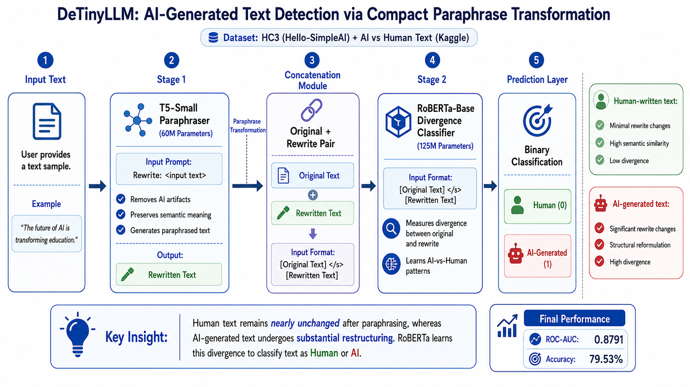
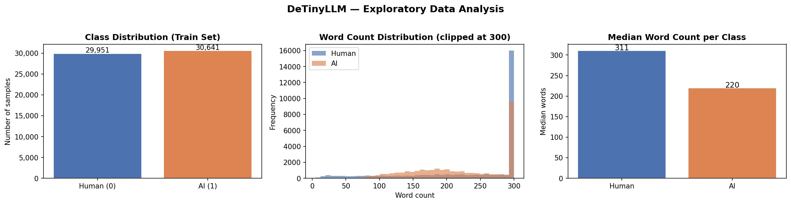
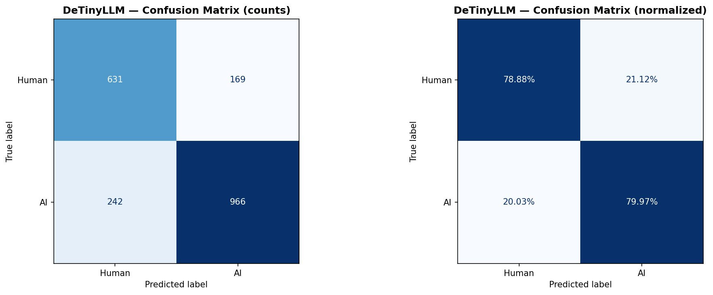

# DeTinyLLM — AI-Generated Text Detection via Compact Paraphrase Transformation

[](https://doi.org/10.1016/j.inffus.2025.103713)
[](https://www.python.org/)
[](https://colab.research.google.com/github/Sanjanadharanikota/DeTinyLLM/blob/main/DETINYLLM.ipynb)
[](LICENSE)

A lightweight two-stage framework that detects whether a piece of text was written by a human or generated by an LLM — **without** calling any external API.

Based on the paper: *"DeTinyLLM: Efficient detection of machine-generated text via compact paraphrase transformation"* — Tan et al., Information Fusion 127 (2026).


The goal of this project is to reproduce the core ideas of the paper using a resource-efficient setup based on T5-Small and RoBERTa-Base, making the framework accessible for experimentation on Google Colab and consumer GPUs.


---

## Architecture




## How It Works

Most state-of-the-art detectors (like SimLLM) query GPT-4 or Gemini APIs and measure how similar the regenerated output is to the original. This is slow ($3.50/1k queries, 33s latency) and breaks whenever the API updates.

DeTinyLLM replaces that with two small local models:

```
Input Text
    │
    ▼
┌─────────────────────────────────────┐
│  Stage 1: T5-small (60M params)     │  ← "De-AI-ifies" text
│  Prompt: "Rewrite: <input>"         │     Strips AI artifacts
│  Output: paraphrased version        │     Preserves semantics
└─────────────────────────────────────┘
    │ original + rewrite (concatenated)
    ▼
┌─────────────────────────────────────┐
│  Stage 2: RoBERTa-base (125M params)│  ← Reads divergence
│  Input: [original] </s> [rewrite]   │     Human text → minimal change
│  Output: Human (0) / AI (1)         │     AI text → major change
└─────────────────────────────────────┘
```

**The key insight:** AI-generated text gets heavily restructured by T5 (BLEU < 0.4), while human text stays nearly identical (BLEU > 0.95). RoBERTa classifies based on that divergence gap.

---
## Features

- Two-stage AI-generated text detection pipeline
- T5-Small based paraphrase transformation
- RoBERTa-Base divergence classifier
- Fully local inference (no GPT-4 or Gemini API calls)
- HC3 + AI vs Human Text dataset integration
- Memory-efficient training with dataset caching
- Automated rewrite generation and filtering
- Baseline comparison using TF-IDF + Logistic Regression
- ROC-AUC and Accuracy evaluation
- Confusion matrix and EDA visualizations


## Results

| Metric | Value |
|--------|-------|
| **ROC-AUC** | **0.8791** |
| **Accuracy** | **0.7953** |
| Inference latency | 7.66s / 1k words |
| SimLLM latency | 33.67s / 1k words |
| Cost per 1k queries | $0.15 vs $3.50 (SimLLM) |

## Visualizations

### Exploratory Data Analysis




### Confusion Matrix (2,008 test samples)





|  | Predicted Human | Predicted AI |
|--|----------------|--------------|
| **Actual Human** | 631 (78.88%) ✅ | 169 (21.12%) ❌ |
| **Actual AI** | 242 (20.03%) ❌ | 966 (79.97%) ✅ |

---

## Repository Structure

```text
DeTinyLLM/
├── DeTinyLLM.ipynb       ← Main notebook (run this)
├── README.md             ← This file
├── requirements.txt      ← Python dependencies
├── LICENSE
├── .gitignore
│
├── assets/
│   ├── architecture.png
│   ├── eda_plot.png            ← EDA visualizations (class balance, word count)
│   └── confusion_matrix.png    ← Model evaluation confusion matrices
│
└── sample_outputs/
    └── example_prediction.txt  ← Sample inference output (Human vs AI prediction)
```


**Not included (too large / runtime artifacts):**
- `data/` — download datasets separately (see below)
- `models/` — saved to Google Drive during training
- `pipeline_state.json` — auto-generated during runs

---

## Datasets

The notebook uses two datasets automatically:

| Dataset | Source | Size | Notes |
|---------|--------|------|-------|
| **HC3** (Hello-SimpleAI) | HuggingFace — loaded automatically | ~37k Q&A pairs | Human vs ChatGPT answers |
| **AI vs Human Text** (Kaggle) | [Download here](https://www.kaggle.com/datasets/shanegerami/ai-vs-human-text) | ~487 MB | Must be placed manually |

**Setup:** Place the Kaggle CSV at:
```
MyDrive/DETINYLLM/data/AI_Human.csv
```

---

## Quickstart

### 1. Open in Google Colab

1. Upload `DeTinyLLM.ipynb` to your Colab environment
2. Set runtime to **GPU** (`Runtime → Change runtime type → T4 GPU`)
3. Mount your Google Drive when prompted

### 2. Place the Kaggle dataset

Download `AI_Human.csv` from [Kaggle](https://www.kaggle.com/datasets/shanegerami/ai-vs-human-text) and put it at:
```
MyDrive/DETINYLLM/data/AI_Human.csv
```

### 3. Run the notebook top to bottom

The pipeline is fully **cached** — each step saves its output to Drive. If your session disconnects, rerunning the notebook picks up exactly where it left off.

| Step | What runs | Time (first run) |
|------|-----------|-----------------|
| Splits | Load HC3 + Kaggle, build parquet splits | ~8 min |
| T5 training | Fine-tune T5-small for 3 epochs | ~25 min |
| Rewrite generation | Generate rewrites for all splits | ~40 min |
| RoBERTa training | Fine-tune classifier for up to 8 epochs | ~35 min |
| Evaluation | ROC-AUC + accuracy on test set | ~2 min |

---

## Notebook Sections

| # | Section | Description |
|---|---------|-------------|
| 1 | Environment Setup | Install dependencies, verify GPU |
| 2 | Drive Mount | Connect Google Drive, verify dataset path |
| 3 | Core Imports | PyTorch, Transformers, Pandas |
| 4 | Config & Paths | Hyperparameters, directory structure |
| 5 | Memory Utils | `print_memory()` and `force_os_memory_release()` |
| 6 | Pre-Train EDA | Raw dataset inspection before preprocessing |
| 7–8 | Data Pipeline | HC3 + Kaggle loading, cleaning, caching |
| 9 | T5Dataset | PyTorch Dataset for seq2seq training |
| 10 | DeTinyLLMDataset | PyTorch Dataset for (original, rewrite) pairs |
| 11 | Train T5 | Fine-tune T5-small paraphraser |
| 12 | Rewrite Function | `rewrite_texts()` with ROUGE quality filter |
| 13 | Generate Rewrites | Apply T5 to all splits, cache results |
| 14 | Train RoBERTa | Fine-tune divergence classifier (v8 final) |
| 15 | Evaluation | ROC-AUC, accuracy, classification report |
| 16 | Inference Pipeline | `predict_text()` + `print_result()` |
| 17 | **Main** | Orchestrates full pipeline end-to-end |
| 18 | Post-Train EDA | Class balance + word count visualizations |
| 19 | Baseline Comparison | TF-IDF + Logistic Regression benchmark |
| 20 | Confusion Matrix | Visual breakdown of TP/FP/TN/FN |
| — | Efficiency Benchmark | Latency vs baseline and GPT-4 API estimate |
| — | Inference Demo | Live examples: Human, AI, Adversarial |
| — | Model Loader | Reload models after session restart |

---

## Key Design Decisions

| Choice | Why |
|--------|-----|
| T5-small not T5-large | Fits in T4 VRAM; BLEU > 0.93 still achieved |
| `max_new_tokens=128` | Prevents truncated rewrites that destroyed quality in v6 |
| Freeze layers 0–3 (both models) | Preserves low-level syntax features; speeds training |
| LR = 2e-5, no label smoothing | Label smoothing artificially inflates loss on binary tasks |
| `ACCUM_STEPS = 4` | Effective batch of 64 with 16 samples per GPU step |
| `RobertaTokenizerFast` | Never generates `token_type_ids` — eliminates a fragile `.pop()` hack from v6 |
| Chunked Kaggle reading | Prevents RAM crash on the 487 MB CSV |

---

## Version History (RoBERTa Classifier)

| Version | Key Change | Problem It Fixed |
|---------|-----------|-----------------|
| v6 | Baseline | Inverted class weights + LR 2e-5 → val spike to 0.88 |
| v7 | Fixed weights, LR 8e-6 | Too slow — still at 0.60 loss at epoch 5 |
| **v8 (current)** | LR back to 2e-5, no label smooth, 8 epochs, 4 frozen layers | Proper convergence — root cause was weights, not LR |

---

## Requirements

torch>=2.0.0
transformers>=4.40.0
datasets>=2.18.0
evaluate>=0.4.0
rouge_score>=0.1.2
sentencepiece>=0.1.99
accelerate>=0.27.0
pandas>=2.0.0
numpy>=1.24.0
pyarrow>=14.0.0
scikit-learn>=1.3.0
psutil>=5.9.0
requests>=2.31.0
matplotlib>=3.7.0
tqdm>=4.66.0

Install with:
```bash
pip install -r requirements.txt
```

---

## Citation

If you use this implementation, please cite the original paper:

```bibtex
@article{tan2026detinyllm,
  title   = {DeTinyLLM: Efficient detection of machine-generated text via compact paraphrase transformation},
  author  = {Tan, Shilei and Zhou, Yongcheng and Liu, Haoxiang and Wang, Xuesong and Chen, Si and Gong, Wei},
  journal = {Information Fusion},
  volume  = {127},
  pages   = {103713},
  year    = {2026},
  doi     = {10.1016/j.inffus.2025.103713}
}
```

---

## Author

**Sanjana Dharanikota**


## License

MIT — see [LICENSE](LICENSE) for details.
